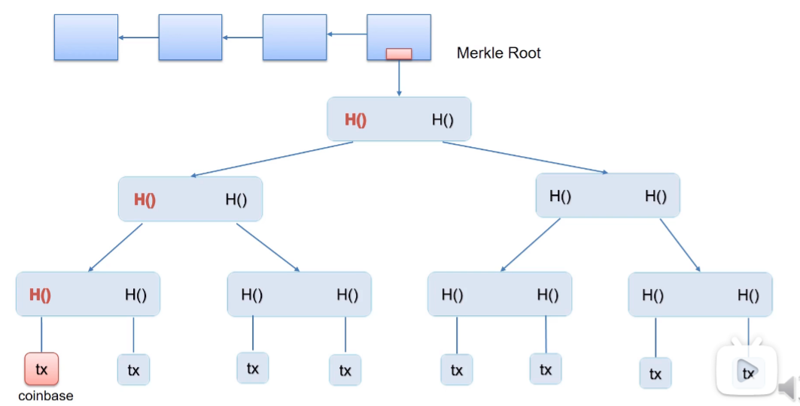
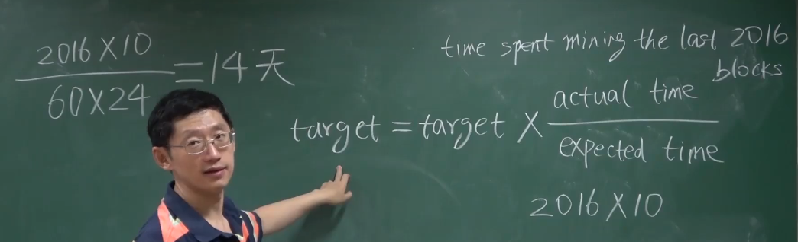

# 加密算法

## 哈希

- crypto-currency-加密货币

- cryptographic hash function-密码哈希函数  

- collision resistance-抗碰撞性，不能人为制造哈希碰撞

- brute-force蛮力，穷举

- Message digest：信息摘要，信息指纹

- hiding哈希不可逆，即哈希值不会泄露原数据的信息，但是可以蛮力破解。hiding前提，输入空间足够大，分布足够均匀

- digital commitment电子承诺

- 预测结果不能提前公开，但是事后公开要保证不被篡改，预测结果要交给第三方公证机构。所以提前公布哈希值，事后公布预测结果，这样无法篡改
- puzzle friendly哈希的结果不可预测
- 挖矿就是找一个随机数nonce，随机数和区块头一起作为输入，要求哈希结果小于等于一个阈值
- puzzle friendly是说挖矿没有捷径，所以挖矿可以作为工作量证明
- 比特币用的哈希函数叫SHA-256，即secure hash algorithm

## 签名

### 账户管理

- 开户的过程：在本地创造一个公私钥对，加密用的公钥，解密用的私钥，公钥私钥用的都是接收方的，好处是公钥可以公开，私钥只要自己保留就行了
- 公钥相当于银行账号，私钥相当于账户密码 
- 如何知道交易是由我发起的，我对我的交易使用私钥签名，其他人用我的公钥验证签名的正确性，加密和签名的公私钥方式是相反的
- 先用hash函数求摘要，使用私钥对摘要加密，然后使用公钥解密
- 
- 具体可以用对称加密或者非对称加密对文件进行加密

# 比特币数据结构

## 哈希指针

- 不仅要保存结构体的地址，还要保存结构体的哈希值，便于检测结构体有没有被篡改

## 区块链和普通链表的区别

- 用哈希指针代替了普通指针
- tamper-evident log  篡改证明记录
- 牵一发而动全身

## 区块的结构

- 区块头包括版本，前一个区块头的哈希，默克尔根哈希，目标阈值和随机数
- 区块体包含了交易列表
- 之所以不对区块体取哈希，是因为默克尔根哈希就保证了账单中的交易不被篡改
- 

## Merkle Tree默克尔树

- 与二叉树的区别就是用哈希指针代替了普通指针
- 
- 好处：只要知道根哈希，就能检测出树中任何部位的修改，因为树中任何一个部位的修改都将导致根哈希的变化
- 把参与记帐的每一台计算机称为一个节点
- 一个区块链是由多个块链接在一起组成的链条，每个节点都保存相同的一个链条
- 全节点包括区块头和区块体，轻节点(SPV)只保存block header
- 系统中大多数节点都是轻节点，轻节点不参与区块链的构造和维护
- Merkle Proof
- 轻节点想要知道某个交易是否在默克尔树中，需要向全节点请求Merkle Proof中的部分哈希值，再加上自己的计算算出根哈希，跟自己区块头的根哈希比较一下就可以知道该树有没有包含此交易了，只有自己的计算是可靠的

# 协议

- 比特币系统中每个交易都包含了输入和输出，输入要说明币的来源和转账者的公钥，输出要说明收款人公钥的哈希
- 哈希指针有两种，一种是为了链接区块，一种是为了说明币的来源，指向前面某个交易，这样可以防范双花问题
- a向b转账，币的来源是a要证明的，a要在交易上签名，a要知道b的账户（b的公钥取哈希）；b要知道a的公钥，a的公钥代表了a的身份 ，好让b知道这钱是从哪来的，而且所有节点都需要知道a的公钥，为了验证a的签名；币的来源的交易中有a的公钥的哈希，这要和a说的自己的公钥要对得上

## 共识（Consensus）

### 根据账户数目投票不可取

- 有女巫攻击，即攻击者可以产生大量账户来投票

### 区块链中根据计算力来投票

- 每个节点在本地都可以组装候选区块，然后尝试不同的nonce值以满足target，如果某个节点找到了符合条件的nonce，就说它获得了记账权，就是发布下一个区块的权利
- 其他节点收到新区块后要验证区块的合法性
- 假如一个新的区块插入到了一个分支，检测交易是否合法只会对照该区块前面的区块，如果该区块回滚了后面区块的交易是无法检测出来的
- 
- 比特币协议中规定接受的区块应该扩展最长合法链，可以避免分叉攻击
- 如果两个节点同时发布新区块，会出现分叉，即等长的最长合法链，直到某一个分叉后面接上了新的区块即为胜出，另一个分叉的区块将被丢弃
- 要接在哪一个区块后边是在挖矿前就决定的，因为要把前一个区块头的哈希填入此区块头

### 共识总结

- 大家要对记账本中的内容取得共识
- 只有获得记账权的节点才能记账
- 只有解出target才能获得记账权
- target是比特币官方发布的 根据全网难度调整target的范围，每隔2016个区块要调整难度，保证出块时间在10min左右

# 比特币系统实现

## UTXO

- 比特币的全节点要维护一个UTXO的数据结构（未被花费的交易输出）如在一笔交易中有多个输出，a向bc转账，b花掉了而c没有花掉，则b对应的输出不在utxo中而c对应的输出在utxo中
- 
- utxo集合中每个元素要给出产生这个输出交易的哈希值以及它在这个交易中是第几个输出
- utxo可以检测双花问题，全节点要在内存中维护utxo以便快速检测双花问题

## 激励机制

- 发布一个区块可以获得一些比特币奖励，奖励每21万个区块减半
- 交易费，每记录一笔交易会有一笔小费
- 一笔交易的输入总金额和输出总金额的差值就是交易费

## 区块实例

### 铸币交易举例

- coinbase就是每个区块的第一个交易，没有输入只有输出，凭空造钱，可以随意改备注
- 修改coinbase域就会影响根哈希，进而影响区块头的哈希，可以搭配nonce来解target（如果块头4个字节的nonce不够解出target）
- 

### 普通交易举例

- 左边的output实际上是输入，他表示输入的来源是哪些交易的输出

## 挖矿概率分析

- 每次尝试nonce可以看做是一个伯努利实验，其中成功的概率微乎其微
- 很多次伯努利实验组成了伯努利过程，伯努利过程具有无记忆性，即前面的实验结果对后面的实验结果没有影响
- 当成功的概率很小时伯努利过程可以用泊松过程来近似
- 我们关心的是出块时间，通过推导可以知道出块时间服从指数分布，指数分布也是无记忆的。如果挖了十分钟还没挖到，那么接下来挖到的平均时间还是十分钟
- 将来还要挖多长时间，跟过去已经挖了多长时间是没有关系的。这个过程也叫:progress free 如果没有这个性质，那么算力强的矿工就有绝对优势，这个性质保证了挖矿的公平性

## 安全问题

- 分叉攻击可以篡改新写入的块
- 比特币网络中的交易，只有已经被记录到区块链，并且已经得到6个确认的，才被认为是真实的，只有基于这些真实交易发起的新交易（输入与输出的概念），才是合法的。
- 区块链的不可篡改性只是概率上的保证，随着后续区块的增加，前面区块被篡改的概率呈指数级别降低 

## 验证交易真实性

我们询问一个交易是否真实，往往基于以下前提：

- 一个交易是否已被记录到区块链中
- 这个交易所在的区块链是否在最长合法链上
- 当每个节点接收到一条交易广播时，我们要查询作为一笔新交易的输入的真实性
- 矿工对交易进行打包之前，对所有的输入进行真实性验证（在矿工接收到交易信息时就已经验证过了，打包的时候验证2000条交易信息不可能）

# 比特币网络

## 网络结构

- 如果要加入这个网络要先知道一个种子节点，种子节点会告诉我他所知道的网络中的其他节点
- 节点之间通过tcp通信的，这样有利于穿过防火墙

## 设计原则

- 简单鲁棒，而不是高效
- 每个节点维护一个邻居节点的集合
- 消息通过flooding的方式传播
- 1个区块最大不超过1M  

# 比特币挖矿难度调整

- target越小，挖矿难度越大，调整挖矿难度的原理是调整目标空间占整个输出空间的比例
- 挖矿难度和目标阈值是呈反比的，挖矿难度最小是1

## 出块时间

- 如果n个节点基本同时挖到矿，区块链就会产生n分叉
- 如果出块时间很短，就会产生很多分叉,分叉过多对于系统达成共识是没有好处的，诚实算力会因此被分散，恶意节点可以集中算力挖一个分叉，攻击越容易成功
- 每2016个区块调整一次挖矿难度
- 

- 区块头中的nbits是target值的压缩编码

# 挖矿中的趋势

## 回顾

## 挖矿设备

- CPU-->GPU-->ASIC芯片

- 

  特殊应用集成电路

- ASIC芯片只能计算哈希值

## 矿池

- 单个矿工出了挖矿之外还要承担全节点的很多其他责任，所以可以把矿工组织起来形成矿池
- 从架构上来说矿池就是一个全节点会驱动很多矿机
- 
- 矿工只负责计算哈希，而pool manager（矿主）负责全节点的其他事情
- 大矿池（超过0.51算力）可以发动的攻击
- - 分叉攻击，为了回滚，即双花攻击，需要等6个确认区块，等待的目的是为了让收款者信任目标交易使得交易成功
- Boycott，即攻击者想要封锁某个账户，就会故意不打包那个账户的交易，也需要分叉攻击，不需要等待6个确认区块
- 矿主不需要有0.51的算力，他只要能动员0.51的算力就行了

# 比特币脚本

- 比特币使用的脚本语言非常简单，能够访问的内存空间只有堆栈

## 交易结构

- vin是输入，vout是输出，blockhash是挖出来的符合条件的哈希值，confirmations是该交易已经获得的确认数

## 交易的输入

- 输入是一个数组，数组中的一个元素说明了币的一个来源，上例是该币来自某交易的第0个输出
- scriptSig是输入脚本，输入脚本最简单的形式就是给一个签名就行了

## 交易的输出

- 输出也是数组，此例有两个输出
- value是输出的金额，就是给对方转了多少钱
- n是序号表示是这个交易中的第几个输出
- ScriptPubKey是输出脚本，输出脚本最简单的形式就是给出一个公钥，reqSigs是说这个输出需要多少个签名才能兑现，address是收款人地址

## 脚本执行

- 要验证右边交易的合法性，是将右边的输入脚本和左边的输出脚本拼接在一起来执行的，拼接时右边输入脚本在前，左边输出脚本在后

### 前区块的输出直接给出收款人的公钥

- 这是拼接后的一个例子，第一行来自输入脚本，23行来自输出脚本
- 首先把输入脚本提供的B的签名压入栈，第二行是把前面区块的输出脚本提供的公钥压入栈，第三行把公钥和签名弹出来，用公钥检查签名是否正确

### 前区块的输出仅给出收款人公钥的哈希

- 此时需要在输入脚本中给出公钥
- 此种方法最常用

### 前区块的输出是收款人提供的一个脚本的哈希

- 收款人提供的这个脚本是redeemScript，即赎回脚本，将来收款人花这个钱时，需要在输入脚本中要给出赎回脚本的具体内容，同时还要给出能让赎回脚本正确运行所需要的签名
- 赎回脚本中给出了验证签名的公钥，付款时需要用公钥检查签名是否正确

## 多重签名 

- 比特币系统中，一个输出可能需要多个签名才能把钱取出来，此时需要多重签名

- 这里的输出脚本是顾客向商家付款的交易中的输出脚本，输入脚本是商家花掉这笔钱的交易中的输入脚本，此时商家要证明顾客的这笔钱是给自己的
- 商家需要证明两个东西，第一，顾客付款时提供的赎回脚本哈希是我自己的赎回脚本，证明钱是我自己的，赎回脚本中包含了验证签名的公钥，第二步，用脚本中的公钥验证对交易的签名，证明钱是本人花出去的

## 一种特殊的输出脚本

- 输出脚本无法执行，说明获得这笔钱的人永远无法花出去这笔钱，这是证明销毁比特币的一种方法

- 这是一个普通的转账交易，输出脚本也是以return开头的只不过输出金额是0，说明并没有销毁任何比特币，输入全部用来给交易费了，收款方只是想花钱往区块链里写一些东西

 

