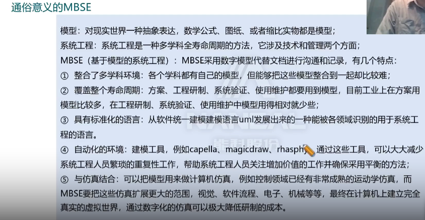
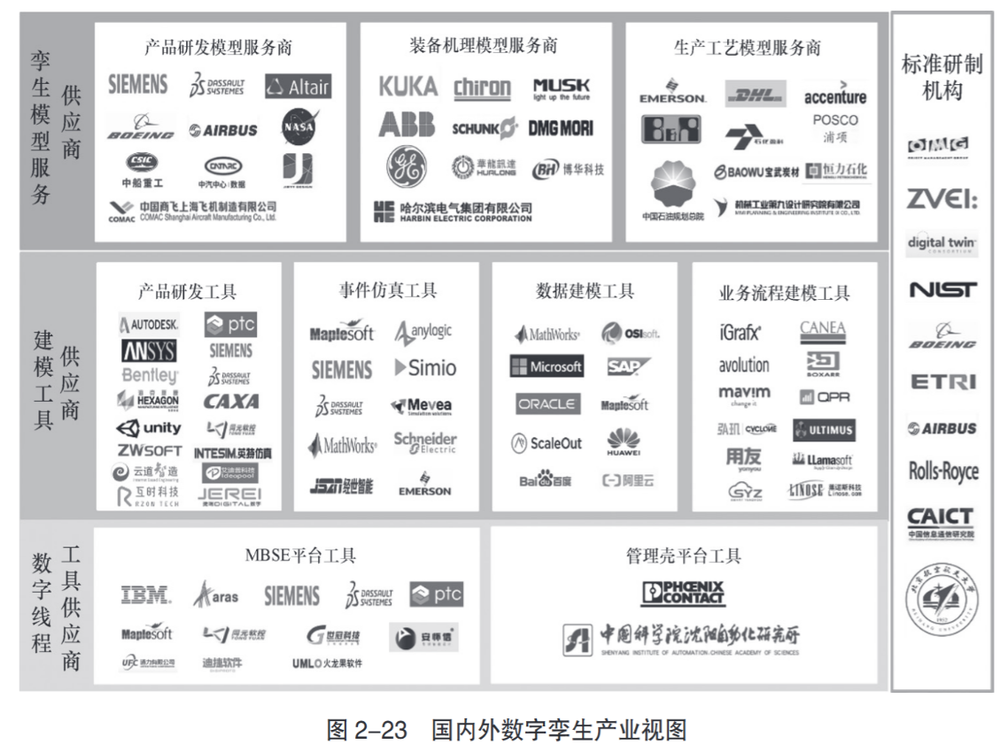
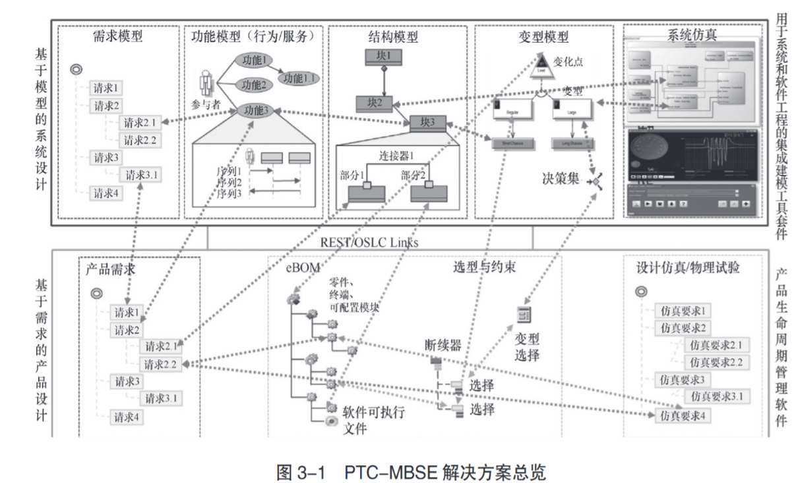
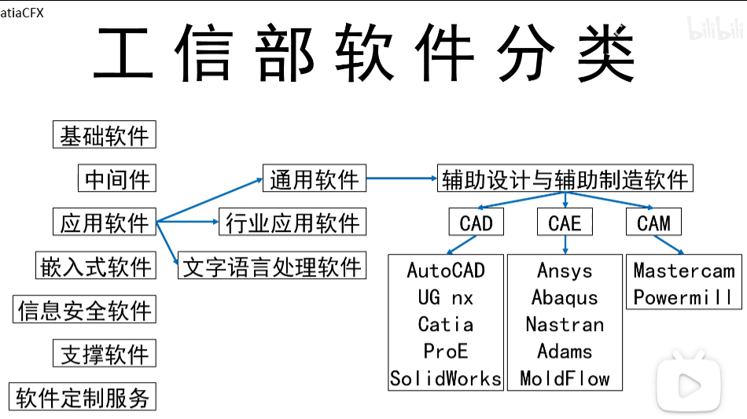
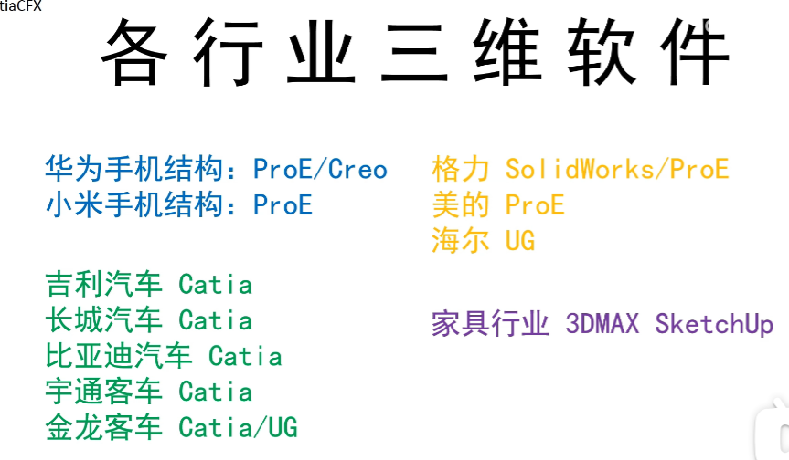
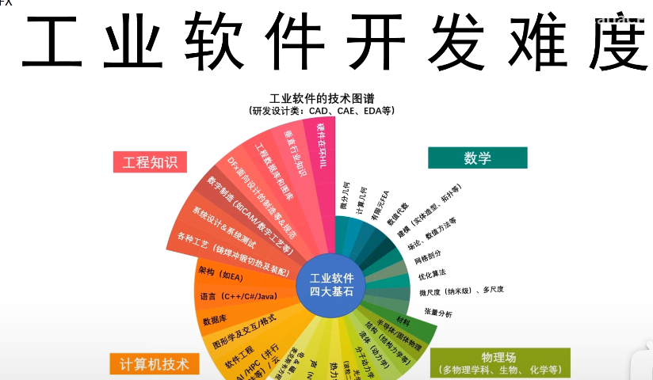

# 数字孪生，数实融合时代的转型之道

## 工业数字孪生概述

### 工业数字孪生架构

- 连接层（感知和控制）
- 映射层（数据互联，信息互通，模型互操作）
- 决策层

### 工业数字孪生技术架构

- 数字支撑技术。数据的获取，传输，计算，管理一体化
- 数字线程技术。如MBSE技术（正向线程），管理壳技术（逆向线程）

### 数字孪生体技术

- 模型构建
- - 几何建模 ，基于AI的创成式设计技术
  - 仿真建模，仿真工具通过无网格划分技术缩短了仿真建模时间
  - 数据建模，传统统计分析+AI
  - 业务建模，BPM，RPA
- 模型融合
- 模型修正，模型基于实际运行数据持续修正模型参数
- 模型验证，验证后可用于生产现场

### 数字孪生发展范式

- 基于信息模型标准化对象属性
- 利用CAD构建数字化形状
- 借助IOT获取对象实时数据
- 利用仿真验证工程机理
- 利用AI绕过复杂机理

### 数字孪生应用

- 3D可视化实时监控
- 基于数字孪生的工艺仿真和参数调优（工艺优化）
- 基于实时仿真的设备深度运维管理，能检测机器那个部位发生故障
- 智能仿真的设备运行优化，开发机器人的数字孪生体

### 工业数字孪生产业体系

- 数字线程工具供应商。提供MBSE（基于模型的系统工程设计）和管理壳两大模型集成管理平台工具，成为数字孪生底层数据和模型互联、互通、互操作的关键支撑。
- - MBSE平台工具：IBM、aras、siemens、ptc、世冠科技、迪捷软件
  - 管理壳平台工具：phcenix contact、中科院沈阳自动化研究所
- 建模工具。包括产品研发工具，事件仿真工具，数据建模工具，业务流程建模工具
- 孪生模型服务提供商

## 供给侧解决方案

### PTC-MBSE解决方案（Model-Based Systems Engineering）

- PTC-MBSE 解决方案的主要内容包括需求模型、功能模型（行为 / 服务）、结构模型、变型模型、系统仿真、产品需求、选型与约束及设计仿真 / 物理试验等
- PTC-MBSE 解决方案主要应用于智能互联产品和高端复杂装备的研制

- 智能互联产品和高端复杂装备的研制面临着以下诸多挑战
- - 系统的复杂性不断增加，因而全生命周期管理的难度也在加大
  - 多专业、多单位参与，质量、成本、进度、风险综合平衡难度大

# 附1工业软件

